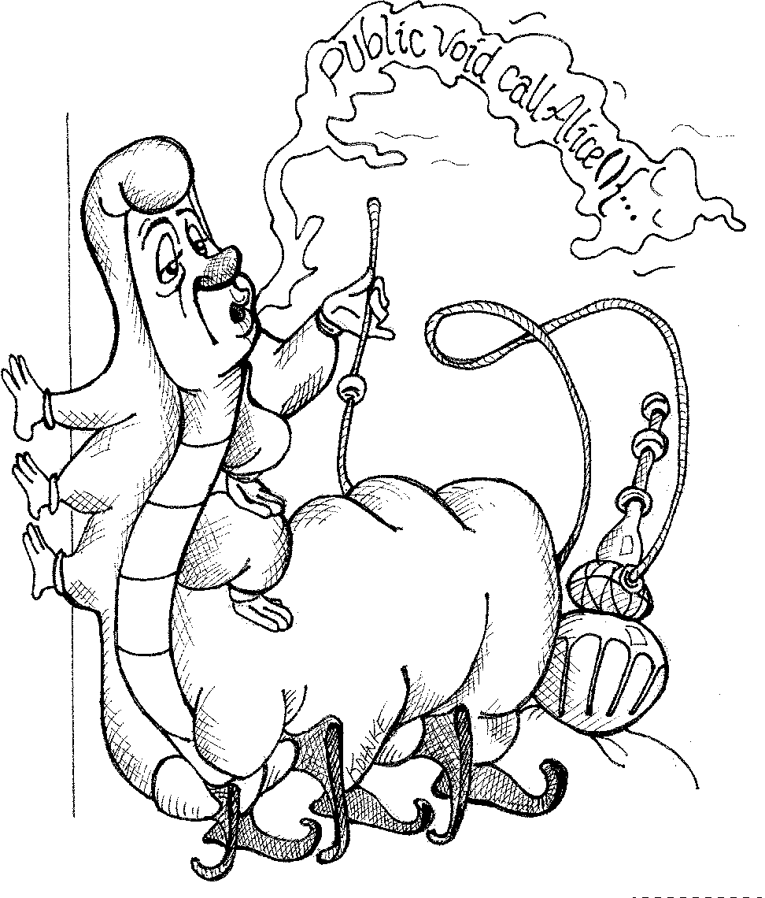

<div dir='rtl'>

# توابع
در اوایل برنامه نویسی ، سیستم های خود را باroutine ها و subroutine ها ساختیم. سپس، در عصر Fortran و PL / 1 سیستم هایمان را با برنامه ها، زیر برنامه ها و توابع ساختیم. امروزه تنها توابع هستند که از آن دوران اولیه باقی مانده اند. توابع اولین خط سازماندهی در هر برنامه هستند. خوب نوشتن آنها موضوع این فصل است.
کد ارائه شده در listing 3-1 را در نظر بگیرید. پیدا کردن یک تابع طولانی در FitNesse1 دشوار است ، اما پس از کمی جستجو به این مورد رسیدم. این تابع نه تنها طولانی است ، بلکه کد تکراری، تعداد زیادی رشته عجیب و غریب و انواع مختلف داده ها و API های عجیب و مبهم را نیز داراست. ببینید که در مدت سه دقیقه آینده چقدر از آن را می توانید درک کنید.
</div>

Listing 3-1
HtmlUtil.java (FitNesse 20070619)


```java
public static String testableHtml(PageData pageData,boolean includeSuiteSetup) throws Exception {
 WikiPage wikiPage=pageData.getWikiPage();
 StringBuffer buffer=new StringBuffer();
 if(pageData.hasAttribute("Test")){
	 if(includeSuiteSetup){
		 WikiPage suiteSetup=PageCrawlerImpl.getInheritedPage(SuiteResponder.SUITE_SETUP_NAME,wikiPage);
		 if(suiteSetup!=null){
			 WikiPagePath pagePath=suiteSetup.getPageCrawler().getFullPath(suiteSetup);
			 String pagePathName=PathParser.render(pagePath);
			 buffer.append("!include -setup .")
				 .append(pagePathName)
				 .append("\n");
		 }
	 }
	 WikiPage setup=PageCrawlerImpl.getInheritedPage("SetUp",wikiPage);
	 if(setup!=null){
		 WikiPagePath setupPath=wikiPage.getPageCrawler().getFullPath(setup);
		 String setupPathName=PathParser.render(setupPath);
		 buffer.append("!include -setup .")
			 .append(setupPathName)
			 .append("\n");
	 }
 }

 buffer.append(pageData.getContent());
 if(pageData.hasAttribute("Test")){
	 WikiPage teardown=PageCrawlerImpl.getInheritedPage("TearDown",wikiPage);
	 if(teardown!=null){
		 WikiPagePath tearDownPath=wikiPage.getPageCrawler().getFullPath(teardown);
		 String tearDownPathName=PathParser.render(tearDownPath);
		 buffer.append("\n")
			 .append("!include -teardown .")
			 .append(tearDownPathName)
			 .append("\n");
	 }

	 if(includeSuiteSetup){
		 WikiPage suiteTeardown=PageCrawlerImpl.getInheritedPage(SuiteResponder.SUITE_TEARDOWN_NAME,wikiPage);
		 if(suiteTeardown!=null){
			 WikiPagePath pagePath=suiteTeardown.getPageCrawler().getFullPath(suiteTeardown);
			 String pagePathName=PathParser.render(pagePath);
			 buffer.append("!include -teardown .")
			 .append(pagePathName)
			 .append("\n");
		 }
	 }
 }
 pageData.setContent(buffer.toString());
 return pageData.getHtml();
}
```
<div dir='rtl'>
آیا بعد از سه دقیقه مطالعه تابع آن را درک می کنید؟ احتمالا نه. اتفاقات زیادی در سطوح تجرید بسیار متفاوت رخ میدهد. رشته ها و فراخوانی های توابع عجیب و غریبی وجود دارد که با زوج جمله های شرطی تو در تو که توسط flag ها کنترل میشوند ترکیب شده اند.
با این حال ، تنها با چند استخراج متد ساده ، تغییر نام و کمی تغییر ساختار ، توانستم هدف این تابع را در 9 سطر در listing 3-2 درج کنم. ببینید که آیا می توانید در 3 دقیقه آینده آن را درک کنید.

</div>

Listing 3-2
HtmlUtil.java (refactored)

```java
    public static String renderPageWithSetupsAndTeardowns( PageData, boolean isSuite) throws Exception 
    {
    boolean isTestPage = pageData.hasAttribute("Test");
        if (isTestPage) 
	{
            WikiPage testPage = pageData.getWikiPage();
            StringBuffer newPageContent = new StringBuffer();
            includeSetupPages(testPage, newPageContent, isSuite);
            newPageContent.append(pageData.getContent());
            includeTeardownPages(testPage, newPageContent, isSuite);
            pageData.setContent(newPageContent.toString());
        }
    return pageData.getHtml();
    }
```
<div dir='rtl'>
مگر اینکه دانشجوی FitNesse باشید که همه جزئیات را بفهمید. با این وجود ، شما احتمالاً می فهمید كه این تابع شامل وارد كردن برخی از صفحات setup و teardown به یك صفحه تست و تبدیل آن صفحه به HTML است. اگر باJUnit  آشنا باشید ، احتمالاً می دانید که این تابع متعلق به نوعی چارچوب تست مبتنی بر وب است. و البته که درست است. استنباط اطلاعات از listing 3-2 بسیار آسان است ، اما با listing 3-1 اطلاعات کاملاً مبهم است.
بنابراین چه چیزی خواندن و درک یک تابع مانند Listing 3-2 را آسان می کند؟ چگونه می توانیم یک تابع را با هدف آن مرتبط کنیم؟ چه ویژگی هایی را می توانیم به توابع خود بدهیم تا امکان درک نوع برنامه ای که آن تابع در آن قرار دارد را به یک خواننده تصادفی 
بدهد؟

### کوچک بودن!
اولین قانون برای توابع این است که آنها باید کوچک باشند. قانون دوم این است که آنها باید از آن هم کوچکتر باشند. این ادعایی نیست که بتوانم توجیه کنم. من نمی توانم به تحقیقاتی اشاره کنم که نشان می دهد توابع بسیار کوچک بهتر هستند. چیزی که می توانم به شما بگویم این است که من نزدیک به چهار دهه توابع مختلفی در ابعاد مختلف نوشتم. چندین مورد ناپسند 3000 خطی نوشتم. من تعداد زیادی تابع در حدود 100 تا 300 خط نوشتم. و توابعی به طول 20 تا 30 خط نوشته ام. آنچه این تجربه از طریق آزمایش طولانی و خطا به من آموخته است اینست که توابع باید بسیار کوچک باشند.
در دهه هشتاد می گفتیم که یک تابع نباید بزرگتر از یک صفحه نمایش باشد. البته این را در زمانی گفتیم که صفحه های VT100, 24 خط در 80 ستون بودند و ویرایشگران ما تنها از 4 خط برای مقاصد مدیریتی استفاده می کردند. امروزه با یک فونت کوتاه شده و یک مانیتور بزرگ خوب ، می توانید 150 کاراکتر را روی یک خط و 100 خط یا بیشتر را در یک صفحه قرار دهید. خطوط نباید 150 کاراکتر داشته باشد. توابع نباید 100 خط باشند. توابع باید به سختی به طول 20 خط برسند.
یک تابع چقدر باید کوتاه باشد؟ در سال 1999 من برای دیدن Kent Beck به خانه اش در Oregon رفتم. ما نشستیم و با هم برنامه نویسی کردیم. در یک لحظه او یک برنامه Java/Swing کوچک زیبا را به من نشان داد که آن را Sparkle نامید. این اثر یک جلوه بصری بسیار شبیه به چوب جادویی الهه افسانه ای در فیلم سیندرلا ایجاد کرد. با حرکت دادن ماوس ، جرقه ها با یک قلاب رضایت بخش از مکان نما بیرون می ریزند و از طریق یک میدان گرانشی شبیه سازی شده به پایین پنجره می افتادند. وقتی Kent کد را به من نشان داد ، من از این که همه توابع چقدر کوچک هستند ، تحت تأثیر قرار گرفتم. من به توابع برنامه های Swing که فضای عمودی زیادی اشغال میکنند، عادت داشتم. هر تابع در این برنامه فقط دو ، سه یا چهار خط طول داشت. هر کدام واضح و آشکار بود. هر کدام داستانی را بیان می کرد. و هر کدام شما را به ترتیبی قانع کننده به سمت بعدی سوق می دادند. این مقدار همانی مقداری است که توابع شما باید به آن اندازه کوچک باشند!1
توابع شما چقدر کوتاه باشد؟ آنها معمولاً باید از listing 3-2 کوتاه تر باشند! در واقع ، listing 3-2 باید به اندازه listing 3-3 کوتاه شود.( من از Kent سؤال کردم که آیا او هنوز یک نسخه دارد ، اما او نتوانست یکی از آنها را پیدا کند. من تمام رایانه های قدیمی خود را نیز جستجو کردم ، اما فایده ای نداشت. تمام آنچه اکنون باقی مانده است ، خاطره من از آن برنامه است.)
</div>

Listing 3-3
HtmlUtil.java (re-refactored)

```java
public static String renderPageWithSetupsAndTeardowns(PageData pageData, boolean isSuite) throws Exception 
{
    if (isTestPage(pageData))
        includeSetupAndTeardownPages(pageData, isSuite);
	
    return pageData.getHtml();
}
```
<div dir='rtl'>

## بلوک ها و تو رفتگی ها
این listing نشان میدهد که بلوک های موجود در جملات شرطی ،  حلقه ها ، و نظایر آن، باید به اندازه یک خط باشند. احتمالاً آن خط باید یک فراخوانی تابع باشد. این کار نه تنها تابع محصور را کوچک نگه می دارد بلکه یک ارزش مستندسازی را نیز به آن اضافه می کند زیرا تابع فراخوانی شده در آن بلوک می تواند نام توصیفی خوبی داشته باشد.
همچنین این listing نشان میدهد توابع نباید برای نگه داشتن ساختارهای تو در تو به اندازه کافی بزرگ باشند. بنابراین ، سطح تورفتگی یک تابع نباید بیشتر از یک یا دو باشد. این امر البته باعث می شود خواندن و درک توابع آسان تر شود.
</div>
### Do One Thing

It should be very clear that Listing 3-1 is doing lots
more than one thing. It’s creating buffers, fetching
pages, searching for inherited pages, rendering paths,
appending arcane strings, and generating HTML,
among other things. Listing 3-1 is very busy doing
lots of different things. On the other hand, Listing 3-3
is doing one simple thing. It’s including setups and
teardowns into test pages.
The following advice has appeared in one form
or another for 30 years or more.
F UNCTIONS SHOULD DO ONE THING . T HEY SHOULD DO IT WELL .
T HEY SHOULD DO IT ONLY .
The problem with this statement is that it is hard to know what “one thing” is. Does
Listing 3-3 do one thing? It’s easy to make the case that it’s doing three things:
1. Determining whether the page is a test page.
2. If so, including setups and teardowns.
3. Rendering the page in HTML.
So which is it? Is the function doing one thing or three things? Notice that the three
steps of the function are one level of abstraction below the stated name of the function. We
can describe the function by describing it as a brief TO 4 paragraph:
TO RenderPageWithSetupsAndTeardowns, we check to see whether the page is a test page
and if so, we include the setups and teardowns. In either case we render the page in
HTML.
If a function does only those steps that are one level below the stated name of the
function, then the function is doing one thing. After all, the reason we write functions is to
decompose a larger concept (in other words, the name of the function) into a set of steps at
the next level of abstraction.
It should be very clear that Listing 3-1 contains steps at many different levels of
abstraction. So it is clearly doing more than one thing. Even Listing 3-2 has two levels of
abstraction, as proved by our ability to shrink it down. But it would be very hard to mean-
ingfully shrink Listing 3-3. We could extract the if statement into a function named
includeSetupsAndTeardownsIfTestPage , but that simply restates the code without changing
the level of abstraction.
So, another way to know that a function is doing more than “one thing” is if you can
extract another function from it with a name that is not merely a restatement of its imple-
mentation [G34].
Sections within Functions
Look at Listing 4-7 on page 71. Notice that the generatePrimes function is divided into
sections such as declarations, initializations, and sieve. This is an obvious symptom of
doing more than one thing. Functions that do one thing cannot be reasonably divided into
sections.
One Level of Abstraction per Function
In order to make sure our functions are doing “one thing,” we need to make sure that the
statements within our function are all at the same level of abstraction. It is easy to see how
Listing 3-1 violates this rule. There are concepts in there that are at a very high level of
abstraction, such as getHtml() ; others that are at an intermediate level of abstraction, such
as: 
String pagePathName = PathParser.render(pagePath) ; 
and still others that are remark-ably low level, such as: .append("\n") .
Mixing levels of abstraction within a function is always confusing. Readers may not
be able to tell whether a particular expression is an essential concept or a detail. Worse,like broken windows, once details are mixed with essential concepts, more and more
details tend to accrete within the function.
Reading Code from Top to Bottom: The Stepdown Rule
We want the code to read like a top-down narrative. 5 We want every function to be fol-
lowed by those at the next level of abstraction so that we can read the program, descending
one level of abstraction at a time as we read down the list of functions. I call this The Step-
down Rule.
To say this differently, we want to be able to read the program as though it were a set
of TO paragraphs, each of which is describing the current level of abstraction and refer-
encing subsequent TO paragraphs at the next level down.
To include the setups and teardowns, we include setups, then we include the test page con-
tent, and then we include the teardowns.
To include the setups, we include the suite setup if this is a suite, then we include the
regular setup.
To include the suite setup, we search the parent hierarchy for the “SuiteSetUp” page
and add an include statement with the path of that page.
To search the parent. . .
It turns out to be very difficult for programmers to learn to follow this rule and write
functions that stay at a single level of abstraction. But learning this trick is also very
important. It is the key to keeping functions short and making sure they do “one thing.”
Making the code read like a top-down set of TO paragraphs is an effective technique for
keeping the abstraction level consistent.
Take a look at Listing 3-7 at the end of this chapter. It shows the whole
testableHtml function refactored according to the principles described here. Notice
how each function introduces the next, and each function remains at a consistent level
of abstraction.
Switch Statements
It’s hard to make a small switch statement. 6 Even a switch statement with only two cases is
larger than I’d like a single block or function to be. It’s also hard to make a switch state-
ment that does one thing. By their nature, switch statements always do N things. Unfortu-
nately we can’t always avoid switch statements, but we can make sure that each switch
statement is buried in a low-level class and is never repeated. We do this, of course, with
polymorphism.
Consider Listing 3-4. It shows just one of the operations that might depend on the
type of employee.
Listing 3-4
Payroll.java

```java
public Money calculatePay(Employee e) throws InvalidEmployeeType 
{
    switch (e.type) 
    {
	case COMMISSIONED:
	    return calculateCommissionedPay(e);
	case HOURLY:
	    return calculateHourlyPay(e);
	case SALARIED:
	    return calculateSalariedPay(e);
	default:
	    throw new InvalidEmployeeType(e.type);
    }
}
```

<div dir='rtl'>
در این تابع چندین مشکل وجود دارد. اولین مشکل بزرگ بودن آن است و زمانی که انواع کارمندان جدید اضافه شد، رشد خواهد کرد. دومین مشکل خیلی واضح است که بیش از یک چیز را انجام می دهد. سومین مشکل این است که اصل مسئولیت واحد 7 (SRP) را نقض می کند زیرا بیش از یک دلیل برای تغییر آن وجود دارد. چهارمین مشکل این است که اصل Open Closed Principle 8 را نقض می کند زیرا هر وقت نوع جدیدی اضافه شود باید تغییر کند.
اما شاید بدترین مشکل این تابع وجود تعداد نامحدودی از توابع دیگر است که همین ساختار را خواهند داشت. مثلاً می توانستیم داشته باشیم
isPayday(Employee e, Date date),
یا
deliverPay(Employee e, Money pay),
یا غیره
همه اینها ساختار نابسامان یکسانی دارند. راه حل این مشکل (رجوع کنید به لیست3-5) این است که عبارت switch را در یک ABSTRACT FACTORY قرار دهید و هرگز اجازه ندهید کسی آن را ببیند.
این کارخانه برای ایجاد نمونه های مناسب از مشتقات Employee از عبارت switch استفاده خواهد کرد و توابع مختلف مثل calculatePay ، isPayday و deliverPay 
از طریق واسط کارمند (Employee interface) به صورت چند ریختی ارسال خواهد شد. قانون کلی من برای عبارات switch این است که اگر فقط یک بار ظاهر شوند و برای ایجاد اشیا چند ریختی استفاده شوند و در پشت یک ارث بری مخفی شوند قابل تحمل خواهند بود.
</div>

Listing 3-5 Employee and Factory

```java
public abstract class Employee 
{
    public abstract boolean isPayday();
    public abstract Money calculatePay();
    public abstract void deliverPay(Money pay);
}
```
-----------------
```java
public interface EmployeeFactory 
{
     public Employee makeEmployee(EmployeeRecord r) throws InvalidEmployeeType;
}
```
-----------------
```java
public class EmployeeFactoryImpl implements EmployeeFactory 
{
    public Employee makeEmployee(EmployeeRecord r) throws InvalidEmployeeType 
    {
        switch (r.type) 
	{
	    case COMMISSIONED:
		return new CommissionedEmployee(r) ;
	    case HOURLY:
		return new HourlyEmployee(r);
	    case SALARIED:
		return new SalariedEmploye(r);
	    default:
		throw new InvalidEmployeeType(r.type);
	}
   }
}
```
relationship so that the rest of the system can’t see them [G23]. Of course every circum-
stance is unique, and there are times when I violate one or more parts of that rule.
Use Descriptive Names
In Listing 3-7 I changed the name of our example function from testableHtml to
SetupTeardownIncluder.render . This is a far better name because it better describes what
the function does. I also gave each of the private methods an equally descriptive name
such as isTestable or includeSetupAndTeardownPages . It is hard to overestimate the value
of good names. Remember Ward’s principle: “You know you are working on clean code
when each routine turns out to be pretty much what you expected.” Half the battle to
achieving that principle is choosing good names for small functions that do one thing.
The smaller and more focused a function is, the easier it is to choose a descriptive
name.
Don’t be afraid to make a name long. A long descriptive name is better than a short
enigmatic name. A long descriptive name is better than a long descriptive comment. Use
a naming convention that allows multiple words to be easily read in the function names,
and then make use of those multiple words to give the function a name that says what
it does.
Don’t be afraid to spend time choosing a name. Indeed, you should try several differ-
ent names and read the code with each in place. Modern IDEs like Eclipse or IntelliJ make
it trivial to change names. Use one of those IDEs and experiment with different names
until you find one that is as descriptive as you can make it.
Choosing descriptive names will clarify the design of the module in your mind and
help you to improve it. It is not at all uncommon that hunting for a good name results in a
favorable restructuring of the code.
Be consistent in your names. Use the same phrases, nouns, and verbs in the function
names you choose for your modules. Consider, for example, the names includeSetup-
AndTeardownPages , includeSetupPages , includeSuiteSetupPage , and includeSetupPage . The
similar phraseology in those names allows the sequence to tell a story. Indeed, if I
showed you just the sequence above, you’d ask yourself: “What happened to
includeTeardownPages , includeSuiteTeardownPage , and includeTeardownPage ?” How’s that
for being “. . . pretty much what you expected.”

## Function Arguments
The ideal number of arguments for a function is
zero (niladic). Next comes one (monadic), followed
closely by two (dyadic). Three arguments (triadic)
should be avoided where possible. More than three
(polyadic) requires very special justification—and
then shouldn’t be used anyway.
Arguments are hard. They take a lot of con-
ceptual power. That’s why I got rid of almost all of
them from the example. Consider, for instance, the
StringBuffer in the example. We could have
passed it around as an argument rather than mak-
ing it an instance variable, but then our readers
would have had to interpret it each time they saw
it. When you are reading the story told by the
module, includeSetupPage() is easier to understand than includeSetupPageInto(newPage-
Content) . The argument is at a different level of abstraction than the function name and
forces you to know a detail (in other words, StringBuffer ) that isn’t particularly important
at that point.
Arguments are even harder from a testing point of view. Imagine the difficulty of
writing all the test cases to ensure that all the various combinations of arguments work
properly. If there are no arguments, this is trivial. If there’s one argument, it’s not too hard.
With two arguments the problem gets a bit more challenging. With more than two argu-
ments, testing every combination of appropriate values can be daunting. Output arguments are harder to understand than input arguments. When we read a
function, we are used to the idea of information going in to the function through arguments
and out through the return value. We don’t usually expect information to be going out
through the arguments. So output arguments often cause us to do a double-take.
One input argument is the next best thing to no arguments. SetupTeardown-
Includer.render(pageData) is pretty easy to understand. Clearly we are going to render the
data in the pageData object.

## Common Monadic Forms
There are two very common reasons to pass a single argument into a function. You may be
asking a question about that argument, as in boolean fileExists(“MyFile”) . Or you may be
operating on that argument, transforming it into something else and returning it. For
example, InputStream fileOpen(“MyFile”) transforms a file name String into an
InputStream return value. These two uses are what readers expect when they see a func-
tion. You should choose names that make the distinction clear, and always use the two
forms in a consistent context. (See Command Query Separation below.)
A somewhat less common, but still very useful form for a single argument function,
is an event. In this form there is an input argument but no output argument. The overall
program is meant to interpret the function call as an event and use the argument to alter the
state of the system, for example, void passwordAttemptFailedNtimes(int attempts) . Use
this form with care. It should be very clear to the reader that this is an event. Choose
names and contexts carefully.
Try to avoid any monadic functions that don’t follow these forms, for example, void
includeSetupPageInto(StringBuffer pageText) . Using an output argument instead of a
return value for a transformation is confusing. If a function is going to transform its input
argument, the transformation should appear as the return value. Indeed, StringBuffer
transform(StringBuffer in) is better than void transform-(StringBuffer out) , even if the
implementation in the first case simply returns the input argument. At least it still follows
the form of a transformation.

## Flag Arguments
Flag arguments are ugly. Passing a boolean into a function is a truly terrible practice. It
immediately complicates the signature of the method, loudly proclaiming that this function
does more than one thing. It does one thing if the flag is true and another if the flag is false!
In Listing 3-7 we had no choice because the callers were already passing that flag
in, and I wanted to limit the scope of refactoring to the function and below. Still, the
method call render(true) is just plain confusing to a poor reader. Mousing over the call
and seeing render(boolean isSuite) helps a little, but not that much. We should have
split the function into two: renderForSuite() and renderForSingleTest() . 

## Dyadic Functions
A function with two arguments is harder to understand than a monadic function. For exam-
ple, writeField(name) is easier to understand than writeField(output-Stream, name) . 10
Though the meaning of both is clear, the first glides past the eye, easily depositing its
meaning. The second requires a short pause until we learn to ignore the first parameter.
And that, of course, eventually results in problems because we should never ignore any
part of code. The parts we ignore are where the bugs will hide.
There are times, of course, where two arguments are appropriate. For example,
Point p = new Point(0,0); is perfectly reasonable. Cartesian points naturally take two
arguments. Indeed, we’d be very surprised to see new Point(0) . However, the two argu-
ments in this case are ordered components of a single value! Whereas output-Stream and
name have neither a natural cohesion, nor a natural ordering.
Even obvious dyadic functions like assertEquals(expected, actual) are problematic.
How many times have you put the actual where the expected should be? The two argu-
ments have no natural ordering. The expected, actual ordering is a convention that
requires practice to learn.
Dyads aren’t evil, and you will certainly have to write them. However, you should be
aware that they come at a cost and should take advantage of what mechanims may be
available to you to convert them into monads. For example, you might make the
writeField method a member of outputStream so that you can say outputStream.
writeField(name) . Or you might make the outputStream a member variable of the current
class so that you don’t have to pass it. Or you might extract a new class like FieldWriter
that takes the outputStream in its constructor and has a write method.
## Triads
Functions that take three arguments are significantly harder to understand than dyads. The
issues of ordering, pausing, and ignoring are more than doubled. I suggest you think very
carefully before creating a triad.
For example, consider the common overload of assertEquals that takes three argu-
ments: assertEquals(message, expected, actual) . How many times have you read the
message and thought it was the expected ? I have stumbled and paused over that particular
triad many times. In fact, every time I see it, I do a double-take and then learn to ignore the
message.
On the other hand, here is a triad that is not quite so insidious: assertEquals(1.0,
amount, .001) . Although this still requires a double-take, it’s one that’s worth taking. It’s
always good to be reminded that equality of floating point values is a relative thing.

## Argument Objects
When a function seems to need more than two or three arguments, it is likely that some of
those arguments ought to be wrapped into a class of their own. Consider, for example, the
difference between the two following declarations:
Circle makeCircle(double x, double y, double radius);
Circle makeCircle(Point center, double radius);
Reducing the number of arguments by creating objects out of them may seem like
cheating, but it’s not. When groups of variables are passed together, the way x and
y are in the example above, they are likely part of a concept that deserves a name of its
own.

## Argument Lists
Sometimes we want to pass a variable number of arguments into a function. Consider, for
example, the String.format method:
```java
String.format("%s worked %.2f hours.", name, hours);
```
If the variable arguments are all treated identically, as they are in the example above, then
they are equivalent to a single argument of type List . By that reasoning, String.format is
actually dyadic. Indeed, the declaration of String.format as shown below is clearly
dyadic.
public String format(String format, Object... args)
So all the same rules apply. Functions that take variable arguments can be monads,
dyads, or even triads. But it would be a mistake to give them more arguments than
that.
```java
void monad(Integer... args);
void dyad(String name, Integer... args);
void triad(String name, int count, Integer... args);
```
## Verbs and Keywords
Choosing good names for a function can go a long way toward explaining the intent of
the function and the order and intent of the arguments. In the case of a monad, the
function and argument should form a very nice verb/noun pair. For example,
write(name) is very evocative. Whatever this “name” thing is, it is being “written.” An
even better name might be writeField(name) , which tells us that the “name” thing is a
“field.”
This last is an example of the keyword form of a function name. Using this form we
encode the names of the arguments into the function name. For example, assertEquals
might be better written as assertExpectedEqualsActual(expected, actual) . This strongly
mitigates the problem of having to remember the ordering of the arguments.
Have No Side Effects
Side effects are lies. Your function promises to do one thing, but it also does other hidden
things. Sometimes it will make unexpected changes to the variables of its own class.
Sometimes it will make them to the parameters passed into the function or to system glo-
bals. In either case they are devious and damaging mistruths that often result in strange
temporal couplings and order dependencies.
Consider, for example, the seemingly innocuous function in Listing 3-6. This function
uses a standard algorithm to match a userName to a password . It returns true if they match
and false if anything goes wrong. But it also has a side effect. Can you spot it?
Listing 3-6
UserValidator.java
```java
public class UserValidator 
{
	private Cryptographer cryptographer;
	public boolean checkPassword(String userName, String password) 
	{
		User user = UserGateway.findByName(userName);
		if (user != User.NULL) 
		{
			String codedPhrase = user.getPhraseEncodedByPassword();
			String phrase = cryptographer.decrypt(codedPhrase, password);
			if ("Valid Password".equals(phrase)) 
			{
				Session.initialize();
				return true;
			}
		}
	return false;
	}
}
```

The side effect is the call to Session.initialize() , of course. The checkPassword func-
tion, by its name, says that it checks the password. The name does not imply that it initial-
izes the session. So a caller who believes what the name of the function says runs the risk
of erasing the existing session data when he or she decides to check the validity of the
user.
This side effect creates a temporal coupling. That is, checkPassword can only be
called at certain times (in other words, when it is safe to initialize the session). If it is
called out of order, session data may be inadvertently lost. Temporal couplings are con-
fusing, especially when hidden as a side effect. If you must have a temporal coupling,
you should make it clear in the name of the function. In this case we might rename the
function checkPasswordAndInitializeSession , though that certainly violates “Do one
thing.”

## Output Arguments
Arguments are most naturally interpreted as inputs to a function. If you have been pro-
gramming for more than a few years, I’m sure you’ve done a double-take on an argument
that was actually an output rather than an input. For example:
appendFooter(s);
Does this function append s as the footer to something? Or does it append some footer
to s ? Is s an input or an output? It doesn’t take long to look at the function signature
and see:
public void appendFooter(StringBuffer report)
This clarifies the issue, but only at the expense of checking the declaration of the function.
Anything that forces you to check the function signature is equivalent to a double-take. It’s
a cognitive break and should be avoided.
In the days before object oriented programming it was sometimes necessary to have
output arguments. However, much of the need for output arguments disappears in OO lan-
guages because this is intended to act as an output argument. In other words, it would be
better for appendFooter to be invoked as
report.appendFooter();
In general output arguments should be avoided. If your function must change the state
of something, have it change the state of its owning object.
Command Query Separation
Functions should either do something or answer something, but not both. Either your
function should change the state of an object, or it should return some information about
that object. Doing both often leads to confusion. Consider, for example, the following
function:
public boolean set(String attribute, String value);
This function sets the value of a named attribute and returns true if it is successful and
false if no such attribute exists. This leads to odd statements like this:
if (set("username", "unclebob"))...
Imagine this from the point of view of the reader. What does it mean? Is it asking whether
the “ username ” attribute was previously set to “ unclebob ”? Or is it asking whether the
“ username ” attribute was successfully set to “ unclebob ”? It’s hard to infer the meaning from
the call because it’s not clear whether the word “ set ” is a verb or an adjective.
The author intended set to be a verb, but in the context of the if statement it feels like
an adjective. So the statement reads as “If the username attribute was previously set to
unclebob ” and not “set the username attribute to unclebob and if that worked then. . . .” We
could try to resolve this by renaming the set function to setAndCheckIfExists , but that
doesn’t much help the readability of the if statement. The real solution is to separate the
command from the query so that the ambiguity cannot occur.
```java
if (attributeExists("username")) {
    setAttribute("username", "unclebob");
    ...
}
```

## Prefer Exceptions to Returning Error Codes
Returning error codes from command functions is a subtle violation of command query
separation. It promotes commands being used as expressions in the predicates of if state-
ments.

```java
if (deletePage(page) == E_OK)
```
This does not suffer from verb/adjective confusion but does lead to deeply nested struc-
tures. When you return an error code, you create the problem that the caller must deal with
the error immediately.
```java
if (deletePage(page) == E_OK) 
{
	if (registry.deleteReference(page.name) == E_OK) 
	{
		if (configKeys.deleteKey(page.name.makeKey()) == E_OK)
		{
			logger.log("page deleted");
		} 
	else
	{
		logger.log("configKey not deleted");
	}
	}
	else
	{
		logger.log("deleteReference from registry failed");
	}
	
} 
else
{
	logger.log("delete failed");
	return E_ERROR;
}
```

On the other hand, if you use exceptions instead of returned error codes, then the error
processing code can be separated from the happy path code and can be simplified:
```java
try
{
   deletePage(page);
   registry.deleteReference(page.name);
   configKeys.deleteKey(page.name.makeKey());
}
catch (Exception e) 
{
    logger.log(e.getMessage());
}
```

## Extract Try/Catch Blocks
Try/catch blocks are ugly in their own right. They confuse the structure of the code and
mix error processing with normal processing. So it is better to extract the bodies of the try
and catch blocks out into functions of their own.
plies that there is some class or enum in which all the
error codes are defined.
```java
public enum Error 
{
    OK,
    INVALID,
    NO_SUCH,
    LOCKED,
    OUT_OF_RESOURCES,
    WAITING_FOR_EVENT;
}
```

Classes like this are a dependency magnet; many other classes must import and use
them. Thus, when the Error enum changes, all those other classes need to be recompiled
and redeployed. 11 This puts a negative pressure on the Error class. Programmers don’t want
to add new errors because then they have to rebuild and redeploy everything. So they reuse
old error codes instead of adding new ones.
When you use exceptions rather than error codes, then new exceptions are derivatives of
the exception class. They can be added without forcing any recompilation or redeployment. 12
Don’t Repeat Yourself 13
Look back at Listing 3-1 carefully and you
will notice that there is an algorithm that
gets repeated four times, once for each of
the SetUp , SuiteSetUp , TearDown , and
SuiteTearDown cases. It’s not easy to spot
this duplication because the four instances
are intermixed with other code and aren’t
uniformly duplicated. Still, the duplication
is a problem because it bloats the code and
will require four-fold modification should the algorithm ever have to change. It is also a
four-fold opportunity for an error of omission.
This duplication was remedied by the include method in Listing 3-7. Read through
that code again and notice how the readability of the whole module is enhanced by the
reduction of that duplication.
Duplication may be the root of all evil in software. Many principles and practices have
been created for the purpose of controlling or eliminating it. Consider, for example, that
all of Codd’s database normal forms serve to eliminate duplication in data. Consider also
how object-oriented programming serves to concentrate code into base classes that would
otherwise be redundant. Structured programming, Aspect Oriented Programming, Compo-
nent Oriented Programming, are all, in part, strategies for eliminating duplication. It
would appear that since the invention of the subroutine, innovations in software develop-
ment have been an ongoing attempt to eliminate duplication from our source code.

## Structured Programming
Some programmers follow Edsger Dijkstra’s rules of structured programming. 14 Dijkstra
said that every function, and every block within a function, should have one entry and one
exit. Following these rules means that there should only be one return statement in a func-
tion, no break or continue statements in a loop, and never, ever, any goto statements.While we are sympathetic to the goals and disciplines of structured programming,
those rules serve little benefit when functions are very small. It is only in larger functions
that such rules provide significant benefit.
So if you keep your functions small, then the occasional multiple return , break , or
continue statement does no harm and can sometimes even be more expressive than the sin-
gle-entry, single-exit rule. On the other hand, goto only makes sense in large functions, so
it should be avoided.

## How Do You Write Functions Like This?
Writing software is like any other kind of writing. When you write a paper or an article,
you get your thoughts down first, then you massage it until it reads well. The first draft
might be clumsy and disorganized, so you wordsmith it and restructure it and refine it until
it reads the way you want it to read.
When I write functions, they come out long and complicated. They have lots of
indenting and nested loops. They have long argument lists. The names are arbitrary, and
there is duplicated code. But I also have a suite of unit tests that cover every one of those
clumsy lines of code.
So then I massage and refine that code, splitting out functions, changing names, elim-
inating duplication. I shrink the methods and reorder them. Sometimes I break out whole
classes, all the while keeping the tests passing.
In the end, I wind up with functions that follow the rules I’ve laid down in this chapter.
I don’t write them that way to start. I don’t think anyone could.
Conclusion
Every system is built from a domain-specific language designed by the programmers to
describe that system. Functions are the verbs of that language, and classes are the nouns.
This is not some throwback to the hideous old notion that the nouns and verbs in a require-
ments document are the first guess of the classes and functions of a system. Rather, this is
a much older truth. The art of programming is, and has always been, the art of language
design.
Master programmers think of systems as stories to be told rather than programs to
be written. They use the facilities of their chosen programming language to construct a
much richer and more expressive language that can be used to tell that story. Part of that
domain-specific language is the hierarchy of functions that describe all the actions that
take place within that system. In an artful act of recursion those actions are written to
use the very domain-specific language they define to tell their own small part of the
story.
This chapter has been about the mechanics of writing functions well. If you follow
the rules herein, your functions will be short, well named, and nicely organized. But never forget that your real goal is to tell the story of the system, and that the functions
you write need to fit cleanly together into a clear and precise language to help you with
that telling.
SetupTeardownIncluder
Listing 3-7
SetupTeardownIncluder.java
```java
package fitnesse.html;
import fitnesse.responders.run.SuiteResponder;
import fitnesse.wiki.*;

public class SetupTeardownIncluder {
	private PageData pageData;
	private boolean isSuite;
	private WikiPage testPage;
	private StringBuffer newPageContent;
	private PageCrawler pageCrawler;

	public static String render(PageData pageData) throws Exception 
	{
		return render(pageData, false);
	}

	public static String render(PageData pageData, boolean isSuite) throws Exception 
	{
		return new SetupTeardownIncluder(pageData).render(isSuite);
	}

	private SetupTeardownIncluder(PageData pageData)
	{
		this.pageData = pageData;
		testPage = pageData.getWikiPage();
		pageCrawler = testPage.getPageCrawler();
		newPageContent = new StringBuffer();
	}

	private String render(boolean isSuite) throws Exception 
	{
		this.isSuite = isSuite;
		if (isTestPage())
			includeSetupAndTeardownPages();
		return pageData.getHtml();
	}

	private boolean isTestPage() throws Exception
	{
		return pageData.hasAttribute("Test");
	}

	private void includeSetupAndTeardownPages() throws Exception
	{
		includeSetupPages();
		includePageContent();
		includeTeardownPages();
		updatePageContent();
	}

	private void includeSetupPages() throws Exception 
	{
		if (isSuite)
			includeSuiteSetupPage();
		includeSetupPage();
	}
	private void includeSuiteSetupPage() throws Exception 
	{
		include(SuiteResponder.SUITE_SETUP_NAME, "-setup");
	}

	private void includeSetupPage() throws Exception
	{
		include("SetUp", "-setup");
	}

	private void includePageContent() throws Exception 
	{
		newPageContent.append(pageData.getContent());
	}

	private void includeTeardownPages() throws Exception 
	{
		includeTeardownPage();
		if (isSuite)
			includeSuiteTeardownPage();
	}

	private void includeTeardownPage() throws Exception 
	{
		include("TearDown", "-teardown");
	}

	private void includeSuiteTeardownPage() throws Exception 
	{
		include(SuiteResponder.SUITE_TEARDOWN_NAME, "-teardown");
	}

	private void updatePageContent() throws Exception 
	{
		pageData.setContent(newPageContent.toString());
	}

	private void include(String pageName, String arg) throws Exception 
	{
		WikiPage inheritedPage = findInheritedPage(pageName);
		if (inheritedPage != null) {
		String pagePathName = getPathNameForPage(inheritedPage);
		buildIncludeDirective(pagePathName, arg);
	}

	}
	
	private WikiPage findInheritedPage(String pageName) throws Exception 
	{
		return PageCrawlerImpl.getInheritedPage(pageName, testPage);
	}
	
	private String getPathNameForPage(WikiPage page) throws Exception 
	{
		WikiPagePath pagePath = pageCrawler.getFullPath(page);
		eturn PathParser.render(pagePath);
	}
	
	private void buildIncludeDirective(String pagePathName, String arg) 
	{
		newPageContent
			.append("\n!include ")
			.append(arg)
			.append(" .")
			.append(pagePathName)
			.append("\n");
	}
}
```
