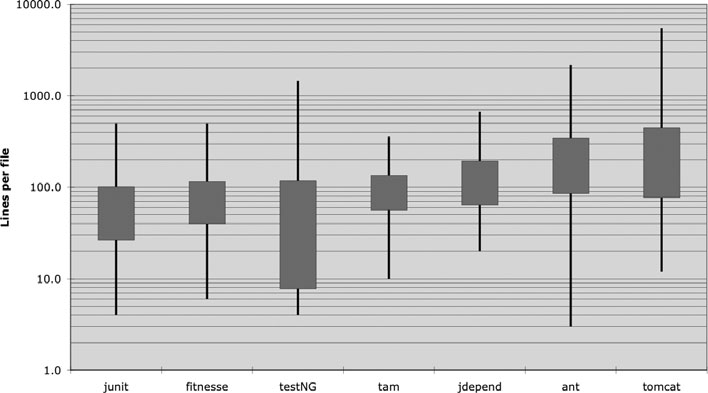
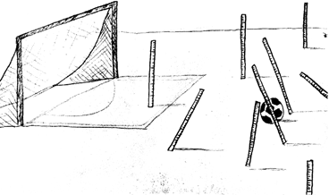

# 5 Formatting


<div dir='rtl'>

هنگامی‌که دیگران شروع می‌کنند به بررسی زیر و بم کد، می‌خواهیم آن‌ها را تحت تأثیر منظم بودن ، قوام و توجه به جزئیاتی که درک می‌کنند تحت تأثیر قرار دهیم. می‌خواهیم با نظم تحت‌تاثیر قرارگیرند. وقتی‌که به ماژول‌ها دقت می‌کنند، ابروهایشان بالا رود. می‌خواهیم بفهمند که افراد حرفه‌ای پشت کار بوده‌اند. اگر در عوض، توده کدی بینند که گویی توسط تعدادی ملوان مست نوشته شده‌است، به احتمال زیاد نتیجه می‌گیرند که همین عدم توجه به جزئیات، بر دیگر جنبه‌های پروژه نیز حاکم است.

باید مراقب باشید که کد شما به خوبی قالب‌بندی شود. باید مجموعه‌ای از قوانین ساده را انتخاب کنید که بر فرمت کد شما حاکم باشد، و سپس باید آن قوانین را به طور مداوم اعمال کنید. اگر در یک تیم کار می‌کنید ، تیم باید با یک مجموعه از قوانین قالب‌بندی موافقت کند و همه اعضا، آن را رعایت کنند. داشتن ابزاری خودکار که بتواند آن قوانین قالب‌بندی را برای شما اعمال کند، می‌تواند کمک‌کننده باشد.

## هدف قالب‌بندی

اول از همه، بگذارید واضح باشیم. قالب‌بندی کد مهم است. بسیار مهم است که نادیده گرفته‌نشود و بسیار مهم است که مثل یک رفتار مذهبی به آن اهمیت دهید. قالب‌بندی کد مربوط به ارتباطات است و ارتباطات، مهمترین بخش برای توسعه‌دهندگان حرفه‌ای است.

شاید فکر کرده باشید که "به نتیجه رساندن" مهمترین بخش برای یک توسعه‌دهنده حرفه‌ای است. با این حال امیدوارم تاکنون این کتاب شما را از این ایده خارج کرده‌باشد. عملکردی که امروز ایجاد می کنید شانس زیادی برای تغییر در نسخه بعدی دارد ، اما خوانایی کد شما تأثیر عمیقی در تمام تغییراتی خواهد داشت که ایجاد می‌شود. شیوه کد نویسی و خوانایی مواردی را ایجاد می کند که مدت ها بعد از تغییر کد اصلی، بر حفظ و توسعه آن تأثیر می گذارد. سبک و نظم شما زنده می ماند ، حتی اگر کد شما اینگونه نباشد.

بنابراین چه موارد قالب‌بندی به ما کمک می‌کند تا بهترین ارتباط را برقرار کنیم؟

## قالب بندی عمودی

بیایید با اندازه عمودی شروع کنیم. یک فایل منبع چقدر باید بزرگ باشد؟ در جاوا ، اندازه فایل با اندازه کلاس ارتباط نزدیک دارد. وقتی در مورد کلاس صحبت کنیم ، درباره اندازه کلاس صحبت خواهیم کرد. در حال حاضر بگذارید فقط اندازه فایل را در نظر بگیریم.

بزرگترین فایل‌های منبع جاوا چقدر بزرگ هستند؟ به نظر می‌رسد که طیف وسیعی از اندازه‌ها و تفاوت‌های قابل توجه در سبک وجود دارد. شکل 5-1 برخی از این تفاوت‌ها را نشان می‌دهد.

هفت پروژه مختلف به تصویر کشیده شده است.Junit, FitNesse, testNG, Time and Money, JDepend, Ant, و Tomcat. خطوط موجود در کادرها حداقل و حداکثر طول فایل را در هر پروژه نشان می‌دهد. این کادر تقریباً یک سوم فایل‌ها (یک انحراف استاندارد) را نشان می دهد. وسط جعبه، میانگین است. بنابراین متوسط اندازه فایل در پروژه FitNesse حدود 65 خط است و حدود یک سوم پرونده ها بین 40 تا 100 خط است. بزرگترین فایل در FitNesse حدود 400 خط و کوچکترین آن 6 خط است. توجه داشته باشید که این مقیاس لگاریتمی است، بنابراین اختلاف کم در موقعیت عمودی نشانگر اختلاف بسیار بزرگ در اندازه مطلق است.
</div>



<div dir='rtl'>
توزیع طول فایل در مقیاس لگاریتمی (box height = sigma)

Junit ، FitNesse و Time and Money از فایل‌های نسبتاً کمی تشکیل شده اند. هیچکدام بیش از 500 خط نیستند و بیشتر این فایل‌ها کمتر از 200 خط هستند. از طرف دیگر ، Tomcat و Ant دارای برخی از فایل‌ها هستند که چندین هزار خط طول دارند و نزدیک به نیمی از آنها بیش از 200 خط هستند.

برای ما چه معنایی دارد؟ به نظر می‌رسد امکان ساخت سیستم های قابل توجهی وجود دارد (FitNesse نزدیک به 50000 خط است) از فایل‌هایی که معمولاً 200 خط طول دارند و حد بالایی آنها 500 است. اگرچه این یک قانون سخت و سریع نیست ، اما باید بسیار مورد توجه قرار گیرد که درک فایل‌های کوچک معمولاً آسانتر از فایل‌های بزرگ است.

### استعاره روزنامه

به یک مقاله خوش نوشت روزنامه فکر کنید. آن را به صورت عمودی می خوانید. در بالا، یک عنوان وجود دارد که به شما بگویید داستان از چه قرار است و به شما امکان می‌دهد تصمیم بگیرید که آیا مطلبی است که می خواهید بخوانید یا نه. پاراگراف اول خلاصه ای از کل داستان را به شما می دهد و تمام جزئیات را پنهان می کند. وقتی به سمت پایین ادامه می دهید ، جزئیات بیشتر می‌شوند، تا زمانی که همه تاریخ‌ها ، نام‌ها ، نقل قول‌ها ، ادعاها و سایر جزئیات را دارید.

دوست داریم که یک فایل منبع مانند مقاله روزنامه باشد. نام باید ساده، اما توضیحی باشد. این نام به خودی خود باید کافی باشد تا به ما بگوید آیا در ماژول درستی هستیم یا نه. بالاترین قسمت‌های فایل منبع باید مفاهیم و الگوریتم‌های سطح بالایی را ارائه دهند. با حرکت به سمت پایین جزئیات باید افزایش یابد تا اینکه در پایان، توابع و جزئیات پایین‌ترین سطح را در فایل منبع پیدا کنیم.

یک روزنامه از مقالات زیادی تشکیل شده است؛ بیشتر آنها بسیار کوچک هستند. بعضی از آنها کمی بزرگتر هستند. تعداد کمی از آنها درحد یک صفحه هستند. این باعث می شود روزنامه قابل استفاده باشد. اگر روزنامه فقط یک داستان طولانی بود که شامل مجموعه‌ای بی‌نظم از واقعیت‌ها‌، تاریخ‌ها و نام‌ها بود‌، به‌راحتی آن را نمی‌خواندیم.

### گشودگی عمودی بین مفاهیم

تقریباً همه کد‌ها از چپ به راست و بالا به پایین خوانده می‌شوند. هر سطر بیانگر یک عبارت یا بند است و هر گروه از خطوط بیانگر یک تفکر کامل است. این افکار را باید با خطوط خالی از یکدیگر جدا کرد.

برای مثال ، لیست 5-1 را در نظر بگیرید. خطوط خالی‌ای وجود دارد که تعریف پکیج ، import(ها) و هر یک از توابع را جدا می کند. این قانون بسیار ساده، تأثیر پیش‌بینی شده‌ای در طرح بصری کد دارد. هر خط خالی، یک نشانه بصری است که مفهوم جدید و جداگانه‌ای را مشخص می‌کند. هنگامی که لیست را اسکن می‌کنید ، چشمتان به اولین خطی می‌رود که بعد یک خط خالی آمده.

</div>

Listing 5-1
BoldWidget.java
```java
package fitnesse.wikitext.widgets;

import java.util.regex.*;

public class BoldWidget extends ParentWidget {
	public static final String REGEXP = "'''.+?'''";
	private static final Pattern pattern = Pattern.compile("'''(.+?)'''",
		Pattern.MULTILINE + Pattern.DOTALL
	);

	public BoldWidget(ParentWidget parent, String text) throws Exception {
		super(parent);
		Matcher match = pattern.matcher(text);
		match.find();
		addChildWidgets(match.group(1));
	}

	public String render() throws Exception {
		StringBuffer html = new StringBuffer("<b>");
		html.append(childHtml()).append("</b>");
		return html.toString();
	}
}
```
<div dir='rtl'>

حذف آن خطوط خالی، مانند لیست 5-2، تأثیر قابل ملاحظه ای در خوانایی کد دارد.

</div>

Listing 5-2
BoldWidget.java

```java
package fitnesse.wikitext.widgets;
import java.util.regex.*;
public class BoldWidget extends ParentWidget {
	public static final String REGEXP = "'''.+?'''";
	private static final Pattern pattern = Pattern.compile("'''(.+?)'''",
	Pattern.MULTILINE + Pattern.DOTALL);
	public BoldWidget(ParentWidget parent, String text) throws Exception {
		super(parent);
		Matcher match = pattern.matcher(text);
		match.find();
		addChildWidgets(match.group(1));
	}
	public String render() throws Exception {
		StringBuffer html = new StringBuffer("<b>");
		html.append(childHtml()).append("</b>");
		return html.toString();
	}
}
```
<div dir='rtl'>

هنگامی که چشم خود را متمرکز نکنید این اثر حتی بیشتر نمایان می شود. در مثال اول، گروه‌بنهدی‌های مختلف خطوط، واضح‌اند، درحالی‌که مثال دوم، به نظر می رسد درهم و برهم است. تفاوت این دو لیست درمقدار کمی از گشودگی عمودی است.

### تراکم عمودی

اگر گشودگی، مفاهیم را از هم جدا کند ، پس تراکم عمودی به معنای یک ارتباط نزدیک است. بنابراین خطوط کدی که کاملاً با هم مرتبط هستند، باید به صورت عمودی متراکم به نظر برسند. توجه کنید که چگونه کامنت‌های بی فایده در لیست 5-3 ارتباط نزدیک دو متغیر نمونه را از بین می‌برد.

</div>

Listing 5-3
```java
public class ReporterConfig {

	/**
	* The class name of the reporter listener
	*/
	private String m_className;
	
	/**
	* The properties of the reporter listener
	*/
	private List<Property> m_properties = new ArrayList<Property>();
	
	public void addProperty(Property property) {
		m_properties.add(property);
	}
}
```
<div dir='rtl'>

خواندن لیست 5-4 بسیار راحت‌تر است. این در یک "نگاه" قرار می‌گیرد ، یا حداقل برای من اینطور است. بدون اینکه خیلی سر یا چشمهایم را حرکت دهم، می توانم به آن نگاه کنم و ببینم که این یک کلاس با دو متغیر و یک تابع است. لیست قبلی من را مجبور می‌کند تا از حرکت چشم و سر بسیار بیشتری برای رسیدن به سطح درک مشابه استفاده کنم.

</div>

Listing 5-4
```java
public class ReporterConfig {
	private String m_className;
	private List<Property> m_properties = new ArrayList<Property>();
	public void addProperty(Property property) {
		m_properties.add(property);
	}
}
```
<div dir='rtl'>

### فاصله عمودی
تابحال شده که در کلاسی پرسه بزنید، از یک تابع به تابع دیگر بروید، سورس فایل را بالا و پایین کنید، ارتباط و عملکرد توابع را بفهمید اما نهایتا گیج شوید؟ آیا تابحال برای فهمیدن تعریف یک متغیر یا تابع به زنجیره‌ای از وراثت برخورد کرده‌اید؟ این ناامیدکننده است زیرا شما در حال فهمیدن این هستید که سیستم چه کاری انجام می دهد ، اما وقت و انرژی ذهنی خود را صرف این می کنید که مکانها را بیابید و به خاطر بسپارید.

مفاهیمی که ارتباط تنگاتنگی دارند باید به صورت عمودی نزدیک به یکدیگر نگه داشته شوند [G10]. واضح است که این قانون برای مفاهیمی که در فایل‌های جداگانه قرار دارند کار نمی کند. اما در این صورت مفاهیم نزدیک به هم را نباید در فایل‌های مختلف جدا کرد ، مگر اینکه دلیل خیلی خوبی داشته باشید. در واقع ، این یکی از دلایلی است که باید از متغیرهای محافظت شده اجتناب شود.

برای آن دسته از مفاهیمی که چنان با هم مرتبط هستند که در همان پرونده منبع قرار دارند ، تفکیک عمودی آنها باید معیاری برای میزان اهمیت هر یک برای قابل درک بودن دیگری باشد. می‌خواهیم از اجبار خوانندگان خود برای جستجوی فایل‌ها و کلاس‌های منبع جلوگیری کنیم.

**تعریف متغیر** متغیرها باید تا حد امکان نزدیک به کاربرد آنها تعریف شوند. از آنجا که توابع ما بسیار کوتاه هستند ، متغیرهای محلی باید در بالای هر تابع ظاهر شوند ، مانند این تابع longish از Junit4.3.1.

</div>

```java
private static void readPreferences() {
	InputStream is= null;
	try {
		is= new FileInputStream(getPreferencesFile());
		setPreferences(new Properties(getPreferences()));
		getPreferences().load(is);
	} catch (IOException e) {
		try {
			if (is != null)
			is.close();
		} catch (IOException e1) {
		}
	}
}
```
<div dir='rtl'>

متغیرهای کنترلی برای حلقه‌ها معمولاً باید در عبارت حلقه اعلان شوند ، همانطور که در این تابع کوچک زیبا از همان منبع وجود دارد.

</div>

```java
public int countTestCases() {
	int count= 0;
	for (Test each : tests)
	count += each.countTestCases();
	return count;
}
```
<div dir='rtl'>

در موارد نادر ، یک متغیر ممکن است در بالای یک بلوک یا درست قبل از حلقه در یک تابع طولانی اعلام شود. چنین متغیری را می توانید از وسط یک تابع بسیار طولانی در TestNG در این قطعه مشاهده کنید.

</div>

```java
...
for (XmlTest test : m_suite.getTests()) {
		TestRunner tr = m_runnerFactory.newTestRunner(this, test);
		tr.addListener(m_textReporter);
		m_testRunners.add(tr);
		invoker = tr.getInvoker();
		for (ITestNGMethod m : tr.getBeforeSuiteMethods()) {
			beforeSuiteMethods.put(m.getMethod(), m);
		}
		for (ITestNGMethod m : tr.getAfterSuiteMethods()) {
			afterSuiteMethods.put(m.getMethod(), m);
		}
}
...
```
<div dir='rtl'>

**متغیرهای نمونه** از طرف دیگر، باید در بالای کلاس اعلام شود. نباید فاصله عمودی این متغیرها را افزایش داد، زیرا در یک کلاس خوب طراحی شده، اگر نه همه ، بسیاری از متدهای کلاس از آنها استفاده می‌کنند.

بحث های زیادی در مورد اینکه متغیرهای نمونه باید به کجا بروند وجود داشته است. در C ++ معمولاً قانون به اصطلاح قیچی را اجرا می‌کنیم که همه متغیرهای نمونه را در پایین قرار می‌دهد. با این حال ، قرارداد رایج در جاوا این است که همه آن‌ها را در بالای کلاس قرار دهید. من دلیلی برای پیروی از هر قرارداد دیگری نمی‌بینم. نکته مهم این است که متغیرهای نمونه در یک مکان شناخته شده اعلام شوند. همه باید بدانند که برای دیدن تعاریف به کجا مراجعه کنند.

به عنوان مثال ، مورد عجیب کلاس TestSuite را در JUnit 4.3.1 در نظر بگیرید. من این کلاس را بسیار ضعیف کردم تا نکته را بیان کنم. اگر نگاهی به نیمه لیست بیندازید ، دو متغیر نمونه  در آنجا تعریف شده. پنهان‌کردن آن‌ها در مکان بهتر دشوار خواهد بود. شخصی که این کد را می خواند باید در تعریف‌ها تصادفی بلغزد (همانطور که من این کار را کردم).

</div>

```java
public class TestSuite implements Test {
	static public Test createTest(Class<? extends TestCase> theClass,
	String name) {
		...
	}
	public static Constructor<? extends TestCase>
	getTestConstructor(Class<? extends TestCase> theClass)
	throws NoSuchMethodException {
		...
	}
	public static Test warning(final String message) {
		...
	}
	private static String exceptionToString(Throwable t) {
		...
	}
	private String fName;
	private Vector<Test> fTests= new Vector<Test>(10);
	public TestSuite() {
	}
	public TestSuite(final Class<? extends TestCase> theClass) {
		...
	}
	public TestSuite(Class<? extends TestCase> theClass, String name) {
		...
	}
	... ... ... ... ...
}
```
<div dir='rtl'>

**توابع وابسته** اگر یک تابع، دیگری را فراخوانی می‌کند ، باید به صورت عمودی نزدیک باشند و در صورت امکان، صدازننده باید بالاتر از صدازده‌شده باشد. این به برنامه جریان طبیعی می‌بخشد. اگر این قرارداد با اطمینان دنبال شود ، خوانندگان می توانند اعتماد کنند که تعاریف تابع کمی بعد از استفاده دنبال می شوند. به عنوان مثال ، قطعه FitNesse را در لیست 5-5 در نظر بگیرید. توجه کنید که بالاترین تابع چگونه توابع زیر خود را فراخوانی می‌کند و چگونه آن‌ها به نوبه خود توابع زیر خود را فراخوانی می‌کنند. این کار، پیدا کردن توابع فراخوانی شده را آسان می‌کند و خوانایی کل ماژول را تا حد زیادی افزایش می‌دهد.

</div>

Listing 5-5
WikiPageResponder.java
```java
public class WikiPageResponder implements SecureResponder {
	protected WikiPage page;
	protected PageData pageData;
	protected String pageTitle;
	protected Request request;
	protected PageCrawler crawler;
	public Response makeResponse(FitNesseContext context, Request request)
	throws Exception {
		String pageName = getPageNameOrDefault(request, "FrontPage");
		loadPage(pageName, context);
		if (page == null)
			return notFoundResponse(context, request);
		else
			return makePageResponse(context);
	}
	private String getPageNameOrDefault(Request request, String defaultPageName) {
		String pageName = request.getResource();
		if (StringUtil.isBlank(pageName))
		pageName = defaultPageName;
		return pageName;
	}
	protected void loadPage(String resource, FitNesseContext context)
	throws Exception {
		WikiPagePath path = PathParser.parse(resource);
		crawler = context.root.getPageCrawler();
		crawler.setDeadEndStrategy(new VirtualEnabledPageCrawler());
		page = crawler.getPage(context.root, path);
		if (page != null)
		pageData = page.getData();
	}
	private Response notFoundResponse(FitNesseContext context, Request request)
	throws Exception {
		return new NotFoundResponder().makeResponse(context, request);
	}
	private SimpleResponse makePageResponse(FitNesseContext context)
	throws Exception {
		pageTitle = PathParser.render(crawler.getFullPath(page));
		String html = makeHtml(context);
		SimpleResponse response = new SimpleResponse();
		response.setMaxAge(0);
		response.setContent(html);
		return response;
	}
}
...
```
<div dir='rtl'>

بعلاوه، این قطعه، نمونه خوبی از نگه داشتن ثابتها در سطح مناسب است [G35]. ثابت "FrontPage" می توانست در تابع getPageNameOrDefault دفن شود ، اما این می تواند یک ثابت شناخته شده و مورد انتظار را در تابع نامناسب سطح پایین پنهان کند. بهتر بود که آن ثابت را از جایی که منطقی است باشد، به محلی انتقال دهیم که واقعاً از آن استفاده می کند.

</div>


**Conceptual Affinity.** Certain bits of code want to be near other bits. They have a certain conceptual affinity. The stronger that affinity, the less vertical distance there should be between them.
As we have seen, this affinity might be based on a direct dependence, such as one function calling another, or a function using a variable. But there are other possible causes of affinity. Affinity might be caused because a group of functions perform a similar operation. Consider this snippet of code from Junit 4.3.1:

```java
public class Assert {
	static public void assertTrue(String message, boolean condition) {
		if (!condition)
			fail(message);
	}
	static public void assertTrue(boolean condition) {
		assertTrue(null, condition);
	}
	static public void assertFalse(String message, boolean condition) {
		assertTrue(message, !condition);
	}
	static public void assertFalse(boolean condition) {
		assertFalse(null, condition);
	}
}
...
```

These functions have a strong conceptual affinity because they share a common naming scheme and perform variations of the same basic task. The fact that they call each other is secondary. Even if they didn’t, they would still want to be close together.

### Vertical Ordering

In general we want function call dependencies to point in the downward direction. That is, a function that is called should be below a function that does the calling. 2 This creates a nice flow down the source code module from high level to low level.

As in newspaper articles, we expect the most important concepts to come first, and we expect them to be expressed with the least amount of polluting detail. We expect the low-level details to come last. This allows us to skim source files, getting the gist from the first few functions, without having to immerse ourselves in the details. Listing 5-5 is organized this way. Perhaps even better examples are Listing 15-5 on page 263, and Listing 3-7 on page 50.

## Horizontal Formatting
How wide should a line be? To answer that, let’s look at how wide lines are in typical programs. Again, we examine the seven different projects. Figure 5-2 shows the distribution of line lengths of all seven projects. The regularity is impressive, especially right around 45 characters. Indeed, every size from 20 to 60 represents about 1 percent of the total number of lines. That’s 40 percent! Perhaps another 30 percent are less than 10 characters wide. Remember this is a log scale, so the linear appearance of the drop-off above 80 characters is really very significant. Programmers clearly prefer short lines.


Java line width distribution

This suggests that we should strive to keep our lines short. The old Hollerith limit of 80 is a bit arbitrary, and I’m not opposed to lines edging out to 100 or even 120. But beyond that is probably just careless.

I used to follow the rule that you should never have to scroll to the right. But monitors are too wide for that nowadays, and younger programmers can shrink the font so small that they can get 200 characters across the screen. Don’t do that. I personally set my limit at 120.

### Horizontal Openness and Density
We use horizontal white space to associate things that are strongly related and disassociate things that are more weakly related. Consider the following function:

```java
private void measureLine(String line) {
	lineCount++;
	int lineSize = line.length();
	totalChars += lineSize;
	lineWidthHistogram.addLine(lineSize, lineCount);
	recordWidestLine(lineSize);
}
```

I surrounded the assignment operators with white space to accentuate them. Assignment statements have two distinct and major elements: the left side and the right side. The spaces make that separation obvious.

On the other hand, I didn’t put spaces between the function names and the opening parenthesis. This is because the function and its arguments are closely related. Separating them makes them appear disjoined instead of conjoined. I separate arguments within the function call parenthesis to accentuate the comma and show that the arguments are separate.

Another use for white space is to accentuate the precedence of operators.

```java
public class Quadratic {
	public static double root1(double a, double b, double c) {
		double determinant = determinant(a, b, c);
		return (-b + Math.sqrt(determinant)) / (2*a);
	}
	public static double root2(int a, int b, int c) {
		double determinant = determinant(a, b, c);
		return (-b - Math.sqrt(determinant)) / (2*a);
	}
	private static double determinant(double a, double b, double c) {
		return b*b - 4*a*c;
	}
}
```

Notice how nicely the equations read. The factors have no white space between them because they are high precedence. The terms are separated by white space because addition and subtraction are lower precedence.

Unfortunately, most tools for reformatting code are blind to the precedence of operators and impose the same spacing throughout. So subtle spacings like those shown above tend to get lost after you reformat the code.

### Horizontal Alignment
When I was an assembly language programmer, 3 I used horizontal alignment to accentuate certain structures. When I started coding in C, C++, and eventually Java, I continued to try to line up all the variable names in a set of declarations, or all the rvalues in a set of assignment statements. My code might have looked like this:

```java
public class FitNesseExpediter implements ResponseSender {
	private         Socket 		socket;
	private 	InputStream     input;
	private 	OutputStream    output;
	private 	Request 	request;
	private 	Response 	response;
	private 	FitNesseContext context;
	protected 	long 		requestParsingTimeLimit;
	private 	long 		requestProgress;
	private 	long 		requestParsingDeadline;
	private 	boolean 	hasError;
	
	public FitNesseExpediter(Socket s,
	FitNesseContext context) throws Exception {
		this.context =            context;
		socket =                  s;
		input =                   s.getInputStream();
		output =                  s.getOutputStream();
		requestParsingTimeLimit = 10000;
	}
}
```

I have found, however, that this kind of alignment is not useful. The alignment seems to emphasize the wrong things and leads my eye away from the true intent. For example, in the list of declarations above you are tempted to read down the list of variable names without looking at their types. Likewise, in the list of assignment statements you are tempted to look down the list of rvalues without ever seeing the assignment operator. To make matters worse, automatic reformatting tools usually eliminate this kind of alignment.

So, in the end, I don’t do this kind of thing anymore. Nowadays I prefer unaligned declarations and assignments, as shown below, because they point out an important deficiency. If I have long lists that need to be aligned, the problem is the length of the lists, not the lack of alignment. The length of the list of declarations in FitNesseExpediter below suggests that this class should be split up.

```java
public class FitNesseExpediter implements ResponseSender {
	private Socket socket;
	private InputStream input;
	private OutputStream output;
	private Request request;
	private Response response;
	private FitNesseContext context;
	protected long requestParsingTimeLimit;
	private long requestProgress;
	private long requestParsingDeadline;
	private boolean hasError;
	public FitNesseExpediter(Socket s, FitNesseContext context) throws Exception {
		this.context = context;
		socket = s;
		input = s.getInputStream();
		output = s.getOutputStream();
		requestParsingTimeLimit = 10000;
	}
}
```

### Indentation
A source file is a hierarchy rather like an outline. There is information that pertains to the file as a whole, to the individual classes within the file, to the methods within the classes, to the blocks within the methods, and recursively to the blocks within the blocks. Each level of this hierarchy is a scope into which names can be declared and in which declarations and executable statements are interpreted.

To make this hierarchy of scopes visible, we indent the lines of source code in proportion to their position in the hiearchy. Statements at the level of the file, such as most class declarations, are not indented at all. Methods within a class are indented one level to the right of the class. Implementations of those methods are implemented one level to the right of the method declaration. Block implementations are implemented one level to the right of their containing block, and so on.

Programmers rely heavily on this indentation scheme. They visually line up lines on the left to see what scope they appear in. This allows them to quickly hop over scopes, such as implementations of if or while statements, that are not relevant to their current situation. They scan the left for new method declarations, new variables, and even new classes. Without indentation, programs would be virtually unreadable by humans.

Consider the following programs that are syntactically and semantically identical:

```java
public class FitNesseServer implements SocketServer { private FitNesseContext
context; public FitNesseServer(FitNesseContext context) { this.context =
context; } public void serve(Socket s) { serve(s, 10000); } public void
serve(Socket s, long requestTimeout) { try { FitNesseExpediter sender = new
FitNesseExpediter(s, context);
sender.setRequestParsingTimeLimit(requestTimeout); sender.start(); }
catch(Exception e) { e.printStackTrace(); } } }
-----

public class FitNesseServer implements SocketServer {
	private FitNesseContext context;
	public FitNesseServer(FitNesseContext context) {
		this.context = context;
	}
	public void serve(Socket s) {
		serve(s, 10000);
	}
	public void serve(Socket s, long requestTimeout) {
		try {
			FitNesseExpediter sender = new FitNesseExpediter(s, context);
			sender.setRequestParsingTimeLimit(requestTimeout);
			sender.start();
		}
		catch (Exception e) {
			e.printStackTrace();
		}
	}
}
```

Your eye can rapidly discern the structure of the indented file. You can almost instantly spot the variables, constructors, accessors, and methods. It takes just a few seconds to realize that this is some kind of simple front end to a socket, with a time-out. The unindented version, however, is virtually impenetrable without intense study.

**Breaking Indentation.** It is sometimes tempting to break the indentation rule for short if statements, short while loops, or short functions. Whenever I have succumbed to this temptation, I have almost always gone back and put the indentation back in. So I avoid collapsing scopes down to one line like this:

```java
public class CommentWidget extends TextWidget {
	public static final String REGEXP = "^#[^\r\n]*(?:(?:\r\n)|\n|\r)?";
	public CommentWidget(ParentWidget parent, String text){
		super(parent, text);
	}
	public String render() throws Exception {
		return ""; 
	}
}
```

I prefer to expand and indent the scopes instead, like this:

```java
public class CommentWidget extends TextWidget {
	public static final String REGEXP = "^#[^\r\n]*(?:(?:\r\n)|\n|\r)?";
	public CommentWidget(ParentWidget parent, String text) {
		super(parent, text);
	}
	public String render() throws Exception {
		return "";
	}
}
```

### Dummy Scopes

Sometimes the body of a while or for statement is a dummy, as shown below. I don’t like these kinds of structures and try to avoid them. When I can’t avoid them, I make sure that the dummy body is properly indented and surrounded by braces. I can’t tell you how many times I’ve been fooled by a semicolon silently sitting at the end of a while loop on the same line. Unless you make that semicolon visible by indenting it on it’s own line, it’s just too hard to see.

```java
while (dis.read(buf, 0, readBufferSize) != -1);
```

## Team Rules



The title of this section is a play on words. Every programmer has his own favorite formatting rules, but if he works in a team, then the team rules.

A team of developers should agree upon a single formatting style, and then every member of that team should use that style. We want the software to have a consistent style. We don’t want it to appear to have been written by a bunch of disagreeing individuals.

When I started the FitNesse project back in 2002, I sat down with the team to work out a coding style. This took about 10 minutes. We decided where we’d put our braces, what our indent size would be, how we would name classes, variables, and methods, and so forth. Then we encoded those rules into the code formatter of our IDE and have stuck with them ever since. These were not the rules that I prefer; they were rules decided by the team. As a member of that team I followed them when writing code in the FitNesse project.

Remember, a good software system is composed of a set of documents that read nicely. They need to have a consistent and smooth style. The reader needs to be able to trust that the formatting gestures he or she has seen in one source file will mean the same thing in others. The last thing we want to do is add more complexity to the source code by writing it in a jumble of different individual styles.

## Uncle Bob’s Formatting Rules

The rules I use personally are very simple and are illustrated by the code in Listing 5-6. Consider this an example of how code makes the best coding standard document.

Listing 5-6
CodeAnalyzer.java
```java
public class CodeAnalyzer implements JavaFileAnalysis {
	private int lineCount;
	private int maxLineWidth;
	private int widestLineNumber;
	private LineWidthHistogram lineWidthHistogram;
	private int totalChars;
	public CodeAnalyzer() {
		lineWidthHistogram = new LineWidthHistogram();
	}
	public static List<File> findJavaFiles(File parentDirectory) {
		List<File> files = new ArrayList<File>();
		findJavaFiles(parentDirectory, files);
		return files;
	}
	private static void findJavaFiles(File parentDirectory, List<File> files) {
		for (File file : parentDirectory.listFiles()) {
			if (file.getName().endsWith(".java"))
			files.add(file);
			else if (file.isDirectory())
			findJavaFiles(file, files);
		}
	}
	public void analyzeFile(File javaFile) throws Exception {
		BufferedReader br = new BufferedReader(new FileReader(javaFile));
		String line;
		while ((line = br.readLine()) != null)
		measureLine(line);
	}
	private void measureLine(String line) {
		lineCount++;
		int lineSize = line.length();
		totalChars += lineSize;
		lineWidthHistogram.addLine(lineSize, lineCount);
		recordWidestLine(lineSize);
	}
	private void recordWidestLine(int lineSize) {
		if (lineSize > maxLineWidth) {
			maxLineWidth = lineSize;
			widestLineNumber = lineCount;
		}
	}
	public int getLineCount() {
		return lineCount;
	}
	public int getMaxLineWidth() {
		return maxLineWidth;
	}
	public int getWidestLineNumber() {
		return widestLineNumber;
	}
	public LineWidthHistogram getLineWidthHistogram() {
		return lineWidthHistogram;
	}
	public double getMeanLineWidth() {
		return (double)totalChars/lineCount;
	}
	public int getMedianLineWidth() {
		Integer[] sortedWidths = getSortedWidths();
		int cumulativeLineCount = 0;
		for (int width : sortedWidths) {
			cumulativeLineCount += lineCountForWidth(width);
			if (cumulativeLineCount > lineCount/2)
			return width;
		}
	throw new Error("Cannot get here");
	}
	private int lineCountForWidth(int width) {
		return lineWidthHistogram.getLinesforWidth(width).size();
	}
	private Integer[] getSortedWidths() {
		Set<Integer> widths = lineWidthHistogram.getWidths();
		Integer[] sortedWidths = (widths.toArray(new Integer[0]));
		Arrays.sort(sortedWidths);
		return sortedWidths;
	}
}
```